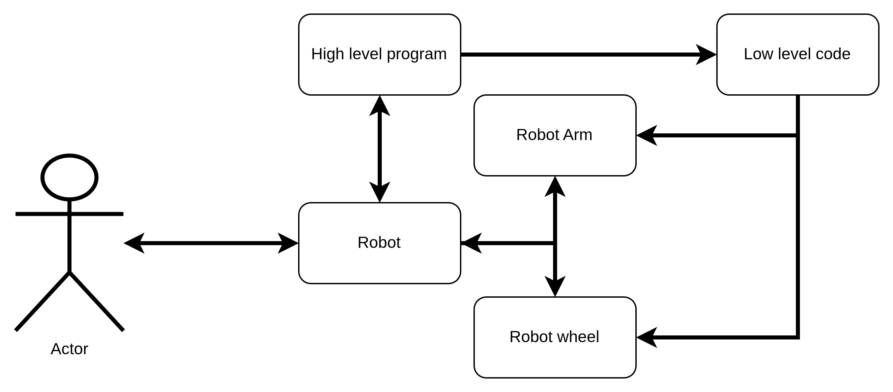
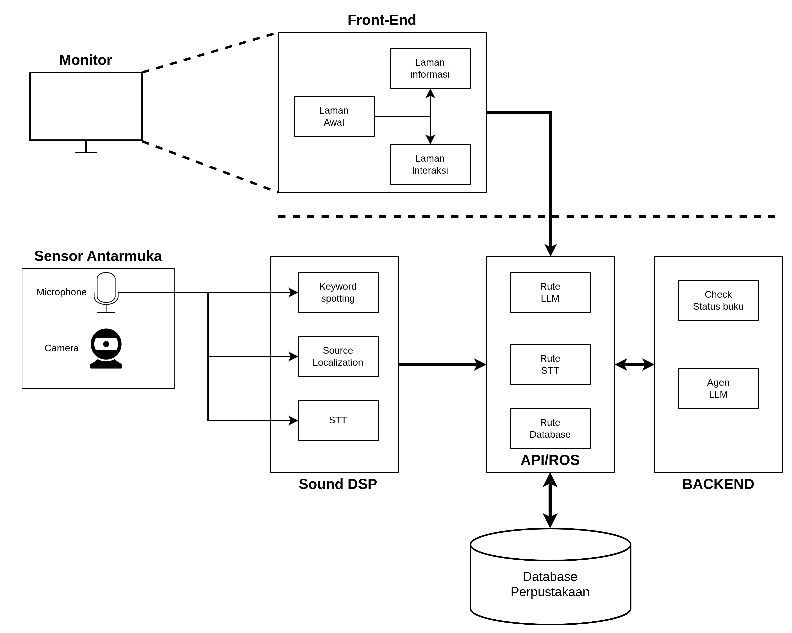

# Library-Robotics

This repo contains the high level code for user experience and interaction

> **Notes:** header with the * (asterisk symbol) means that section is still in progress

## System description



This repo focuses on the high level programming which mainly used for user/actor experience and interaction. Some of the feature which the robots has are as follows,

- Listening
- Vision
- User Information center



### Listening (*)

This feature has to be able to "wake up the robot"/command spotting, find the source of the sound, and then transcribe the audio.

Thus the target in this section are:

- Keyword spotting (low energy voice detection)
- TDOA/sound source localization
- Speech to text (STT) 

### Vision (*)

This feature has to be able to find the presence of the user/actor and detect actor gesture.

Thus the target in this section are:

- Pose estimation using wireframe
- User/actor depth estimation

### User information center (*)

This feature has to be able to give information about the book,find/recomend the user about a book, retain information about the user, and have a fun experience.

Thus the target in this section are:

- LLM for book recomendation and give information about book
- user database
- Good UI

## System Integration (*)

This system uses the ROS2 environment to comunicate between node and thread optimization.

### Installation (*)

To make installtion over many robot easier, a bash file for jetson has been made. To install this program, run the following code in the terminal:

```bash
sudo bash ./install_app.sh
```

### Run the program (*)


To rerun the program upon startup or failure, a bash file also has been made. To restart the code, run the following code in the terminal:

```bash
sudo bash ./start_app.sh
```