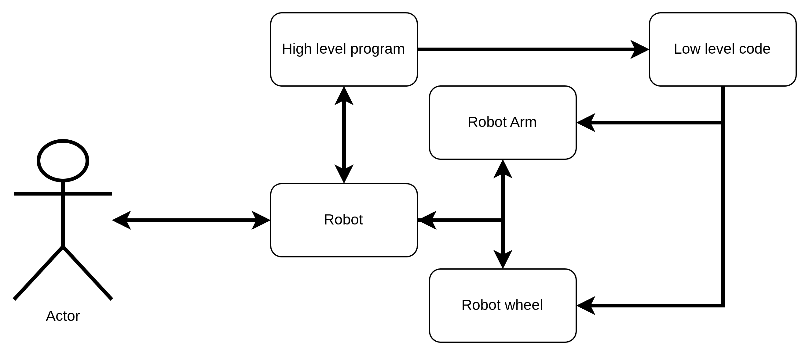
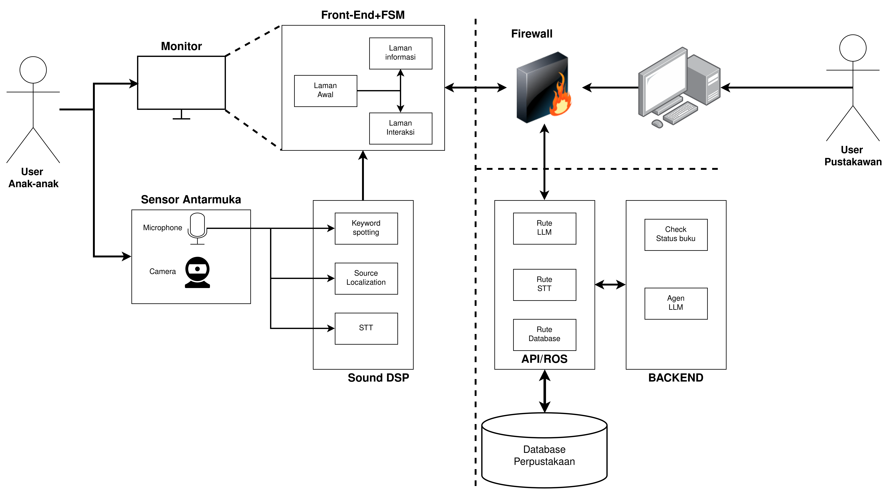

# Library-Robotics

This repo contains the high level code for user experience and interaction

- [x]  Robot
  - [x]  KWS
    - [x]  Labeling
  - [x]  Static file
  - [ ]  STT
  - [x]  Book database API
  - [x]  TTS Indonesia
  - [x]  UI
    - [x]  Homepage
    - [x]  Select
    - [x]  Book read
    - [x]  Book database
    - [x]  API integration
- [x]  Base
  - [x]  Database
  - [x]  Static file server
  - [x]  API testing
  - [x]  docker compose

> **Notes:** header with the * (asterisk symbol) means that section is still in progress

## System description



This repo focuses on the high level programming which mainly used for user/actor experience and interaction. Some of the feature which the robots has are as follows,

- Listening
- Vision
- User Information center


## System Integration

This system uses the ROS2 environment to comunicate between node and thread optimization.

### Listening

This feature has to be able to "wake up the robot"/command spotting, find the source of the sound, and then transcribe the audio.

Thus the target in this section are:

- Keyword spotting (low energy voice detection)
  - [Edge impulse Jetson](https://docs.edgeimpulse.com/hardware/boards/nvidia-jetson)
  - [Edge impulse on python](https://docs.edgeimpulse.com/tools/libraries/sdks/inference/linux/python)
- TDOA/sound source localization
- Speech to text (STT)
  - [indonesian-whisperer](https://github.com/cahya-wirawan/indonesian-whisperer)
  - [Open AI Whisper](https://github.com/openai/whisper)

### Vision (*)

This feature has to be able to find the presence of the user/actor and detect actor gesture.

Thus the target in this section are:

- Pose estimation using Movenet
- User/actor depth estimation

### User information center

directory
s
This feature has to be able to give information about the book,find/recomend the user about a book, retain information about the user, and have a fun experience.


### Installation

To make installtion over many device easier, a bash code has been made. To install this program, run the following code in the terminal:

```bash
bash ./install_app.sh
```

This code will check your docker environment and break the process if there are any missing component like GPU. 4 Container will be installed:

- Robot Side:
  - ros_environment
    - ROS2 Workspace
    - React for on-robot UI
- Server side:
  - librarian_ui 
    - Librarian website client for monitoring and maintaing all things in library
  - library_db
    - Database container for the library
  - server_environment
    - Backend (using python uvicorn and fastAPI) and static file
  
**Make sure to connect all the peripheral beforehand to ensure stability of contaianer and code.**

#### Deployment in robot

In the final deployment for the robot, you may not need (or better not to use a container), thus a new procedure may be needed

#### FAQ

1. Problem with Astra orbec
   1. Make sure you install the rule and drivers according to the astra ROS2 github
2. Privileges in docker 
   1. sometimes (rarely) it might differ between each devices, so just put the error and the docker compose yaml in your favorite LLM to get the answer LOL. 

### Run the program 

RUn the container after a restart on device by running the following command.

```bash
docker start ros_environment librarian_ui library_db server_environment 
```

All program in the container, except the ROS_env, are expected to run without any problem. Sometimes you might want to re-plug the astra orbce or other peripheral. For logging the container/program of your liking run the following commands.

```bash
docker logs -f <container_name_or_id>

```

Running the program for the ROS_env might be a bit trickier as it is still in the development phase. We want to get into container.

To get into the container and use bash, run this command:
```bash
docker exec -it ros_environment bash
```

There are two main program in here, 
1. Ros launch file
2. React UI

##### ROS

This documentation expect that you have the basic understanding of ROS.

1. Running the ROS code  
  In the `~/ws/src/ros_ws` directory inside the ros_environment container run :

   ```bash
   colcon build
   source ./install/setup.bash
   ros2 launch robot_launch demo.launch.xml
   ```

   The above code will run all existing and tested packgage. You can also run individual package/node by it seperately using 
   
   ```bash

   ros2 run <pkg name> <executeables name>
   ```

2. Running the UI code
   In the `~/ws/src/frontend/robot-ui ` run:
   ```
   npm install
   npm audit fix
   npm run dev -- --host 0.0.0.0
   ```

   and open the network url

